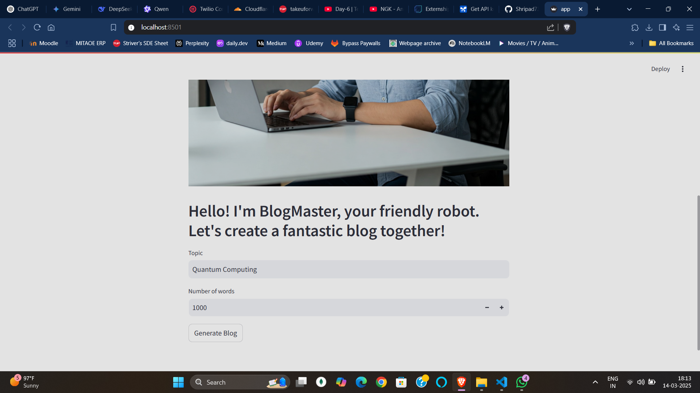
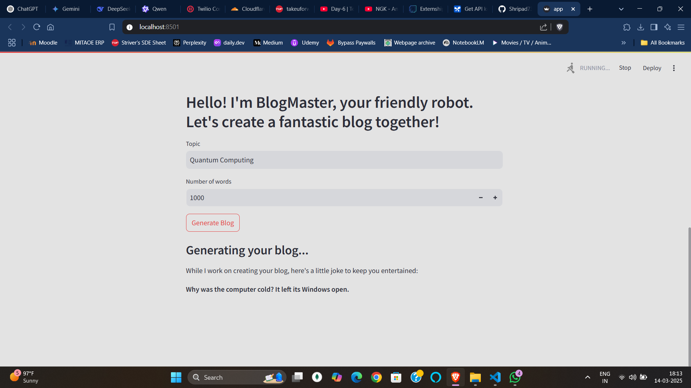
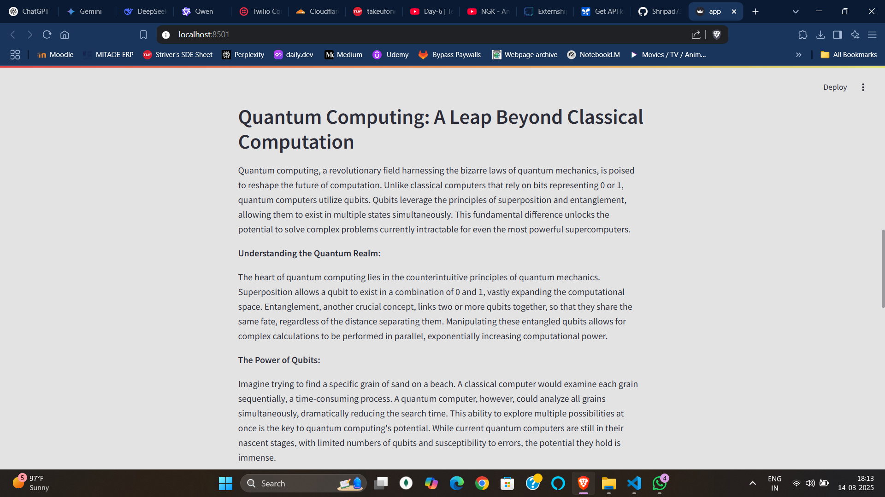

# BlogMaster: AI-Powered Blog Generation

BlogMaster is an intuitive Streamlit application that leverages the power of Google's Gemini 1.5 Pro AI model to generate high-quality blog content based on user-provided topics and word counts. This tool is perfect for content creators, marketers, or anyone looking to quickly create blog drafts or get writing inspiration.

This project is being done under the Smartbridge Generative AI Course.

## Features
- 🤖 AI-powered blog generation using Google's Gemini 1.5 Pro model
- 📝 Customizable word count (100-5000 words)
- ⏱️ Quick generation of well-structured blog content
- 😄 Entertaining programmer jokes while you wait for your blog
- 🎨 Clean and user-friendly interface

## Demo Images







## Installation

### Prerequisites
- Python 3.7+
- A Google Gemini API key

### Setup Instructions

1. Clone the repository:
    ```bash
    git clone https://github.com/your-username/blogmaster.git
    cd blogmaster
    ```

2. Install dependencies:
    ```bash
    pip install -r requirements.txt
    ```

3. Create a `.env` file in the root directory and add your Google Gemini API key:
    ```
    GoogleGeminiAPIKey=your_api_key_here
    ```

4. Start the application:
    ```bash
    streamlit run app.py
    ```

5. Access the web interface:
    Open your browser and go to `http://localhost:8501`

## Usage

1. Enter a topic in the "Topic" field.
2. Use the slider to select your desired word count (100-5000).
3. Click the "Generate Blog" button.
4. Enjoy a programming joke while waiting for your blog to be generated.
5. View and copy your generated blog content.

## Configuration

You can modify the AI generation parameters in the `app.py` file:
```python
generation_config = {
    "temperature": 0.75,  # Controls randomness (lower = more deterministic)
    "top_p": 0.95,        # Nucleus sampling parameter
    "top_k": 64,          # Limits token selection to top K options
    "max_output_tokens": 8192,  # Maximum length of generated content
    "response_mime_type": "text/plain",
}
```

## Dependencies
- streamlit
- google-generativeai
- python-dotenv

## Getting a Google Gemini API Key

1. Visit [Google AI Studio](https://ai.google.com/studio).
2. Create a new account or sign in.
3. Navigate to "API Keys" in your account settings.
4. Create a new API key.
5. Copy the key to your `.env` file.

## Contributing

Contributions are welcome! Feel free to open issues or submit pull requests to help improve BlogMaster.

## License

This project is licensed under the MIT License - see the LICENSE file for details.

## Acknowledgments

- Google Generative AI for providing the Gemini 1.5 Pro model
- Streamlit for the excellent web application framework